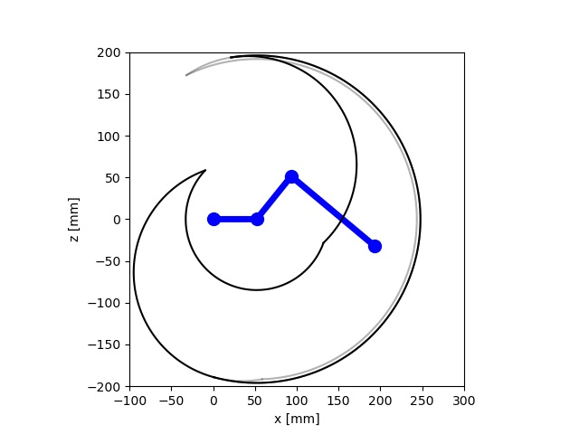
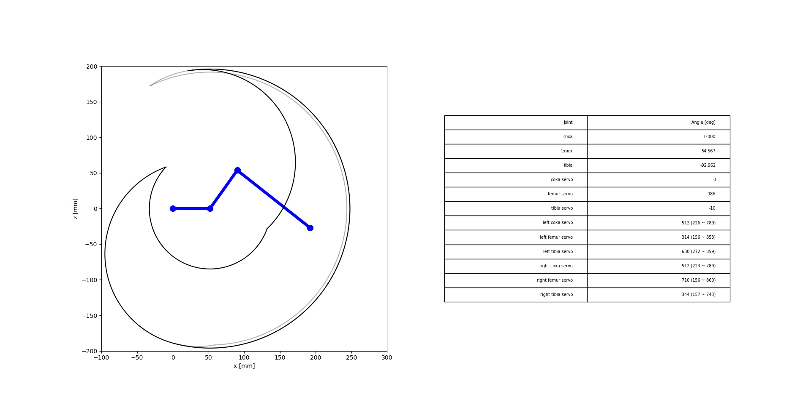
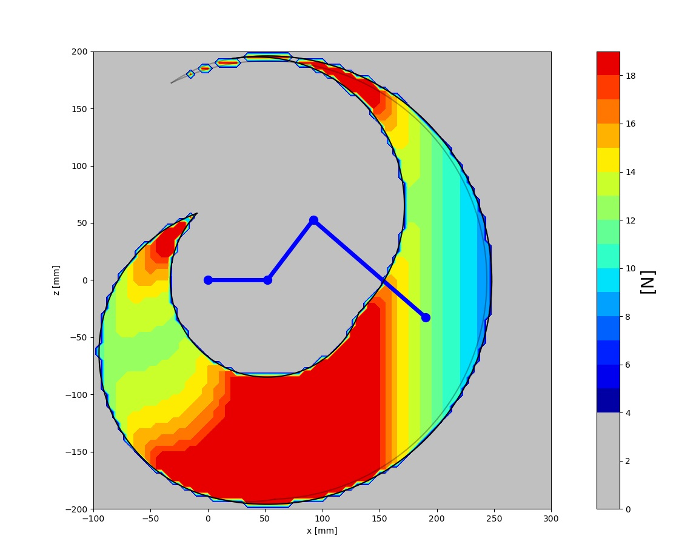
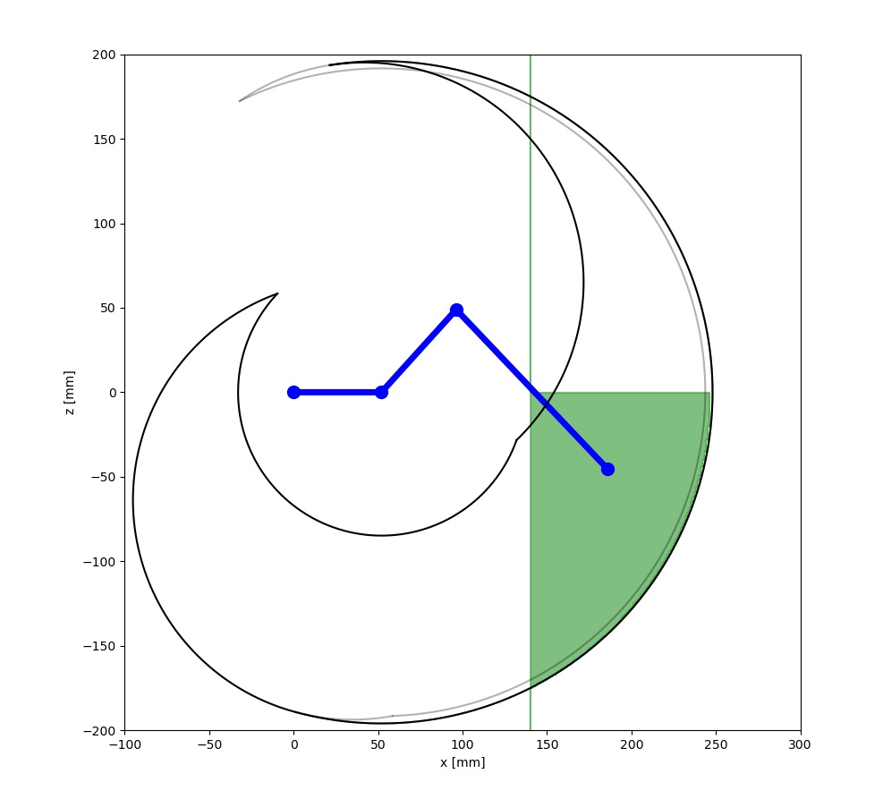

# GraphDisplayerについて

GraphDisplayerクラスは，脚の図示を行うクラスです．
GraphDisplayerはdisplayメソッドのみを持ちます．
displayメソッドは多くの引数を持ちますが，デフォルト値が設定されています．
これらを変更することで，脚の図示をカスタマイズできます．

<div align="center">
    
</div>

## 目次

- [displayメソッド](#displayメソッド)
  - [引数](#引数)
    - [hexapod_pram](#hexapod_pram)
    - [display_table](#display_table)
    - [display_leg_power](#display_leg_power)
    - [display_approximated_graph](#display_approximated_graph)
    - [display_mouse_grid](#display_mouse_grid)
    - [display_ground_line](#display_ground_line)
    - [display_circle](#display_circle)
    - [display_wedge](#display_wedge)
    - [x_min, x_max, z_min, z_max](#x_min-x_max-z_min-z_max)
    - [leg_power_step](#leg_power_step)
    - [approx_fill](#approx_fill)
    - [color_approx](#color_approx)
    - [alpha_approx](#alpha_approx)
    - [color_rom](#color_rom)
    - [alpha_upper_rom](#alpha_upper_rom)
    - [alpha_lower_rom](#alpha_lower_rom)
    - [color_mouse_grid](#color_mouse_grid)
    - [alpha_mouse_grid](#alpha_mouse_grid)
    - [image_file_name](#image_file_name)
    - [ground_z](#ground_z)
    - [do_not_show](#do_not_show)
  - [戻り値](#戻り値)

## displayメソッド

### 引数

```python
def display(self, hexapod_pram = HexapodParam(), *, 
            display_table = True,
            display_leg_power = False,
            display_approximated_graph = True,
            display_mouse_grid = True,
            display_ground_line = True,
            display_circle = True, 
            display_wedge = True,
            x_min = -100.0, x_max = 300.0, z_min = -200.0, z_max = 200.0,
            leg_power_step = 2.0,
            approx_fill = True, color_approx = 'green', alpha_approx = 0.5, 
            color_rom = 'black', alpha_upper_rom = 0.3, alpha_lower_rom = 1.0,
            color_mouse_grid = 'black', alpha_mouse_grid = 0.5,
            image_file_name = "result/img_main.png",
            ground_z = -25.0,
            do_not_show = False) -> Tuple[plt.Figure, axes.Axes, axes.Axes]:
```

#### hexapod_pram

構造体HexapodParamのインスタンスを指定します．
構造体HexapodParamは脚ロボットのパラメータを保持しており，
デフォルト値はPhantomX Mk-2のパラメータを持っています．

#### display_table

Trueの場合，テーブルを表示します．

<div align="center">
    
</div>

#### display_leg_power

Trueの場合，脚先力を表示します．
計算に時間がかかるため，不必要な場合はFalseを推奨します．

<div align="center">
    
</div>

#### display_approximated_graph

Trueの場合，近似された可動範囲のグラフを表示します．
近似された可動範囲については，卒業論文を参照してください．

<div align="center">
    
</div>

#### display_mouse_grid

Trueの場合，マウス追従するグリッド線を表示します．

#### display_ground_line

Trueの場合，地面の線を表示します．

#### display_circle

Trueの場合，脚の可動範囲を円で表示します．

#### display_wedge

Trueの場合，脚の可動範囲を扇形で表示します．

#### x_min, x_max, z_min, z_max

表示する範囲を指定します．単位はmmです．
デフォルトの範囲は，PhantomX Mk-2の可動範囲を囲むように設定されています．

近似された可動範囲のグラフと，脚先力の計算に影響します．
過不足なく可動範囲を囲むように設定してください．

もし，うまく表示されない場合は，1度`display_leg_power`と`display_approximated_graph`をFalseにして，
表示される範囲を確認してください．

#### leg_power_step

脚先力を計算する際のステップ幅を指定します．単位はmmです．
ステップ幅が小さいほど，計算時間がかかります．
範囲にもよりますが，400mm*400mmの範囲であれば，2.0程度で十分です．

マイナスの値は指定できません．

#### approx_fill

Trueの場合，近似された可動範囲のグラフを塗りつぶします．

#### color_approx

近似された可動範囲のグラフの色を指定します．

#### alpha_approx

近似された可動範囲のグラフの透明度を指定します．

#### color_rom

脚の可動範囲のグラフの色を指定します．

#### alpha_upper_rom

脚の可動範囲のグラフの上側の透明度を指定します．

#### alpha_lower_rom

脚の可動範囲のグラフの下側の透明度を指定します．

#### color_mouse_grid

マウス追従するグリッド線の色を指定します．

#### alpha_mouse_grid

マウス追従するグリッド線の透明度を指定します．

#### image_file_name

画像を保存するファイル名を指定します．

#### ground_z

地面の高さを指定します．単位はmmです．

#### do_not_show

Trueの場合，グラフを表示しません．
正確には，`plt.show()`を実行しません．
グラフを表示する前に，グラフに追加で描画を行いたい場合に使用します．
具体的な使い方は[sample_main4.py](../sample_main4.py)を参照してください．

### 戻り値

displayメソッドは，`matplotlib.pyplot.subplots()`の戻り値を返します．
戻り値は，Figureオブジェクトと，Axesオブジェクトが2つです．

Figureオブジェクトは，グラフ全体を表します．
また，Axesオブジェクトは，グラフの各部分を表します．
1つめAxesオブジェクトは脚の可動範囲のグラフ，2つめのAxesオブジェクトは間接角度のテーブルです．

```python
import phantom_cross as pc

gd = pc.GraphDisplayer()
fig, ax1, ax2 = gd.display(do_not_show = True)

# ここに追加で描画を行う
ax1.plot([0, 100], [0, 100], color = 'red')

plt.show()
```

こちらも詳しくは[sample_main4.py](../sample_main4.py)を参照してください．
