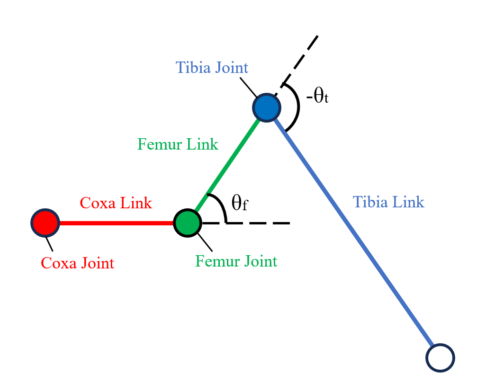
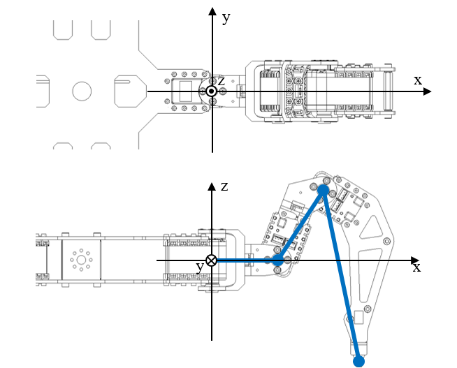

# HexapodParamについて

構造体HexapodParamは，脚ロボットのパラメータを保持しており，
デフォルト値はPhantomX Mk-2のパラメータを持っています．

## パラメータの説明

```python
class HexapodParam:
    coxa_length: float = 52.0     # [mm]
    femur_length: float = 66.0    # [mm]
    tibia_length: float = 130.0   # [mm]
    theta1_max: float = math.radians(81.0)   # [rad]
    theta1_min: float = math.radians(-81.0)  # [rad]
    theta2_max: float = math.radians(99.0)   # [rad]
    theta2_min: float = math.radians(-105)   # [rad]
    theta3_max: float = math.radians(25.5)   # [rad]
    theta3_min: float = math.radians(-145.0) # [rad]
    torque_max: float = 1800.0    # [N*mm] ストールトルク(停動トルク) 

    approx_min_radius: float = 140.0      # [mm]
```

### 脚の長さ

`HexapodParam`では，各リンクの名前をPhantomXに倣い，`coxa`, `femur`, `tibia`としています．
また，パラメータはPhantomX Mk-2のリンクの長さをデフォルト値としています．

`coxa_length`は，脚の第1関節から第2関節までの長さを指定します．
単位はmmで，デフォルト値は52.0mmです．

`femur_length`は，脚の第2関節から第3関節までの長さを指定します．
単位はmmで，デフォルト値は66.0mmです．

`tibia_length`は，脚の第3関節から脚先までの長さを指定します．
単位はmmで，デフォルト値は130.0mmです．

すべてのパラメータは0以上の値を指定してください．

### 間接の可動範囲

関節の角度を表す変数は`coxa`, `femur`, `tibia`の順に`theta1`, `theta2`, `theta3`としています．

`theta1`は座標軸に対して右ねじの方向を正としています．
`theta2` `theta3`は，下図における反時計回りを正としています．

`theta1_max` `theta1_min`は，第1関節の最大・最小角度を指定します．
単位はradで，デフォルト値はそれぞれ81.0度と-81.0度です．
このプログラムでは2次元平面上に表示するため，実質的にこの値は無意味なものになります．

`theta2_max` `theta2_min`は，第2関節の最大・最小角度を指定します．

`theta3_max` `theta3_min`は，第3関節の最大・最小角度を指定します．

すべて-πからπの範囲で指定してください．また，最小を最大より大きく指定しないでください．

<p>
    
    
</p>

### その他のパラメータ

`torque_max`は，サーボモータのストールトルク（停動トルク）を指定します．
デフォルト値はサーボモータ"AX-18A"のストールトルクです．
単位が［N*mm］となっていることに注意してください．

`approx_min_radius`は，近似された可動範囲のグラフを表示する際の最小半径を指定します．
デフォルト値は140.0mmです．
